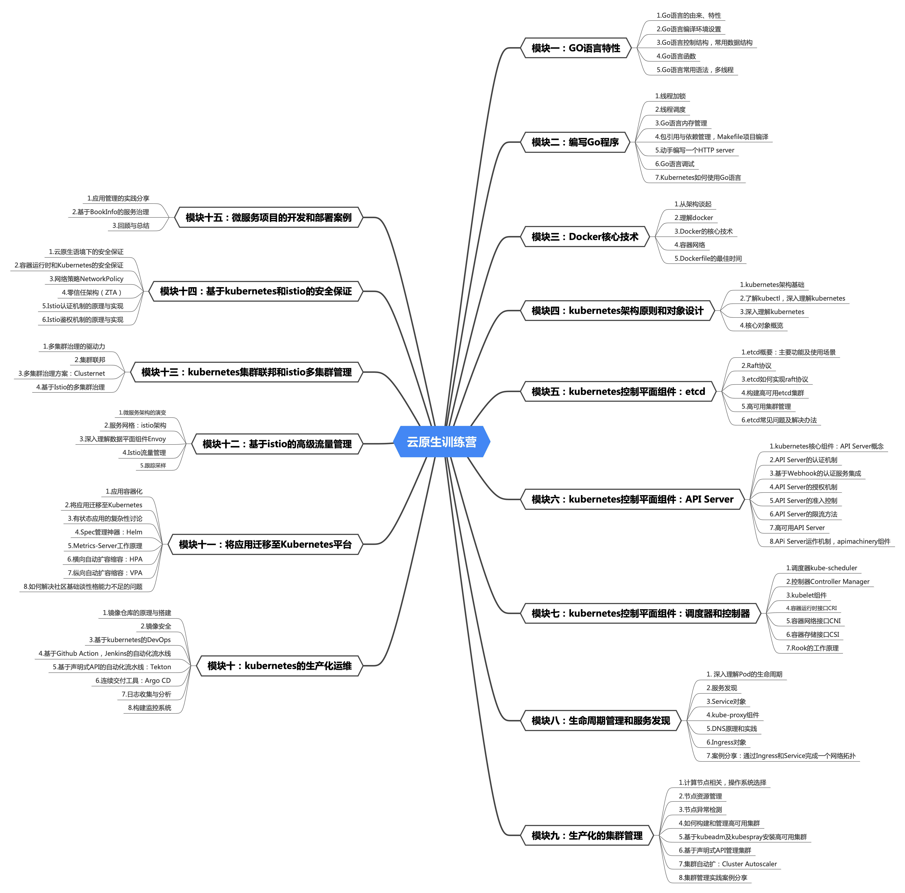

## 一、学习方法

我发现在学习过程自己有些坏毛病：

### （1）奇怪的洁癖

课程里分配了3台计算机，就想着把本地的磁盘释放出来，保持本地环境的整洁，使用线上的环境。其实我的本子16GB内存是可以支持跑几个虚拟机的，但我就是不太愿意去在本地折腾。**资源就是要去消耗的！**


### （2）死磕小问题缺乏讨论

从证书相关章节就没有好好交作业了，promethues相关是需要重新再学习一边。到istio章节因为测试服务器环境calico跨节点pod网络不通，没法完成相关作业。这让我十分的不爽，想着一定要修复，但是**缺乏经验和对架构的认识**，这个问题可能对我来说难度有点太大。

a）我尝试用tcpdump抓包
```bash
$ ping 192.168.166.144
$ sudo tcpdump -v -n -i any host 192.168.166.144
```
但是从结果中我只能看到本地主机相对端发送了icmp消息，但是对端主机似乎根本就没收到这个包。我真的是无解了。

b）我尝试学习calico配置

我去找calico官网学习了相关文档，反复配置installation资源，我尝试配置BGPPeer，使用bgp mesh to mesh网络，但其实bgp在初始的时候一直是开着的，
```
$sudo calicoctl node status
```
使用如上命令去查看网络信息，发现只有172.21.x.x节点本地网段的信息，根本看不到192.168.x.x pod的网段

我尝试关闭BGP，使用overlay网络，尝试配置VXLANCrossSubnet，尝试配置IPIP模式，均没能让pod间的网络互通，最终问题停留在calico-node这个daemonset能运行但是无法ready。进入容器发现是felix组件没有ready，但是看日志一点头绪也没有，实在是奔溃。我觉得我应该把问题发出来去认真讨论下的。

### （3）缺乏总结

学的快忘记的也快，缺乏总结形成自己的知识体系，需要再刷一遍。

## 二、学习总结

第一遍下来缺少了自己的抽象、理解，当前思维导图还只是原始视频的目录。


